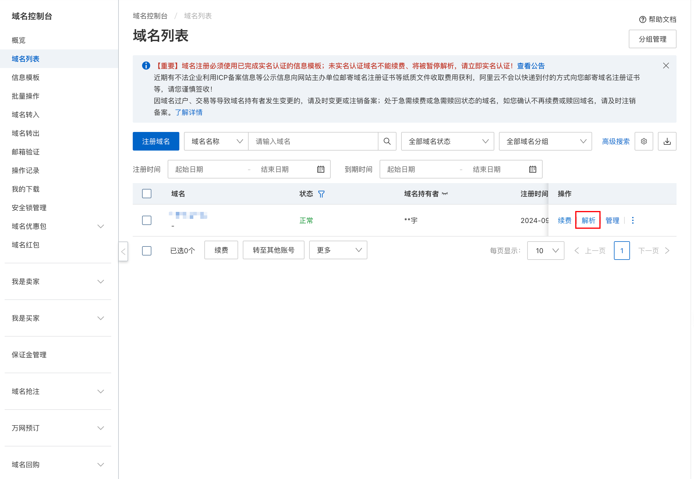
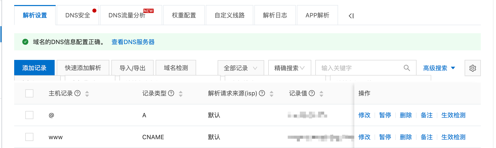
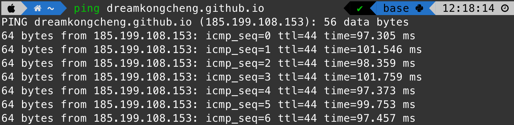
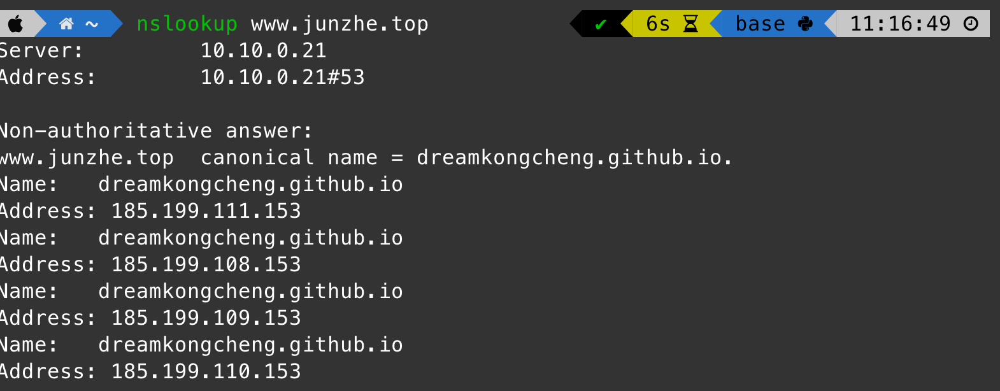
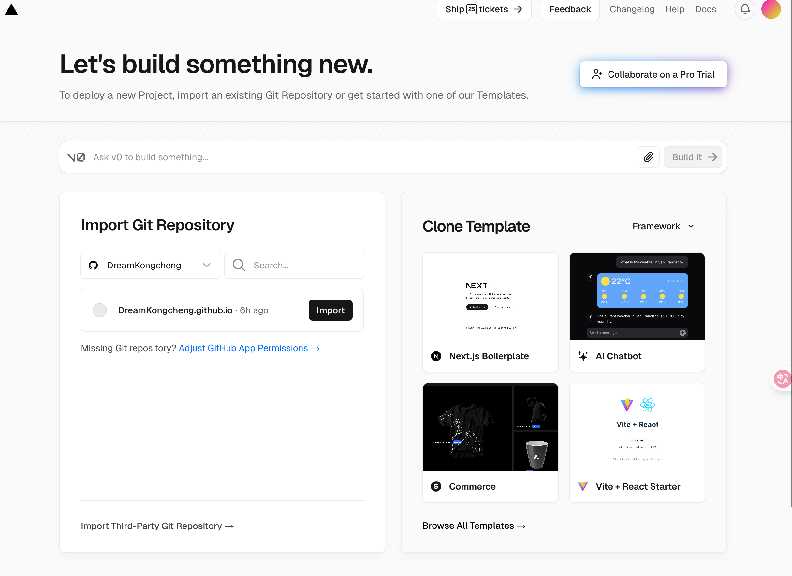
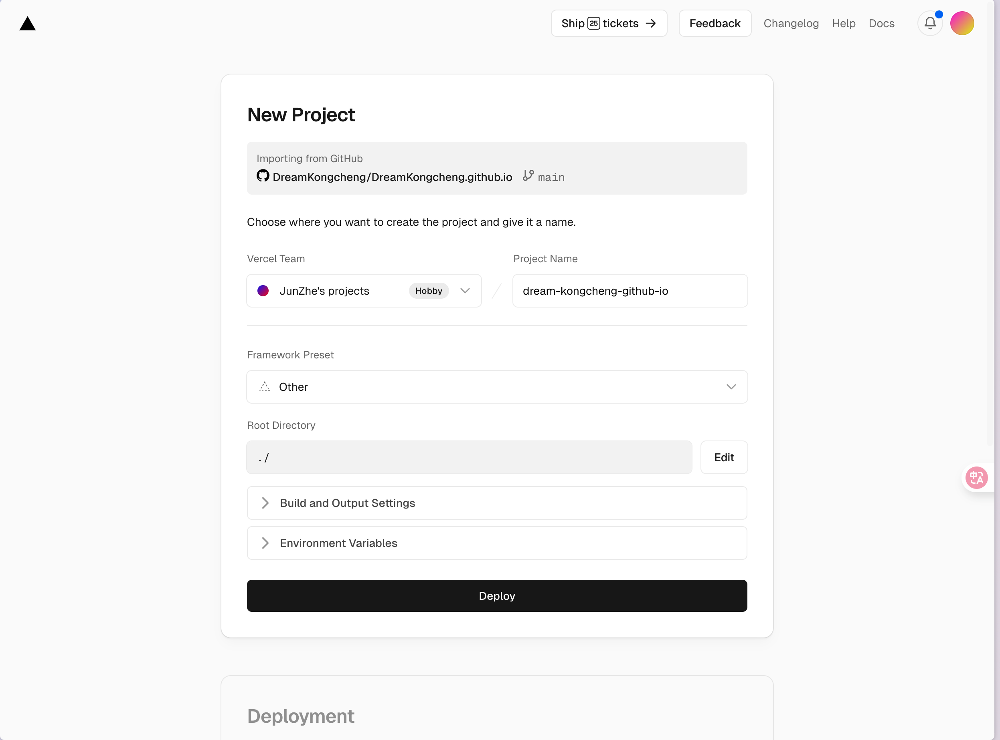
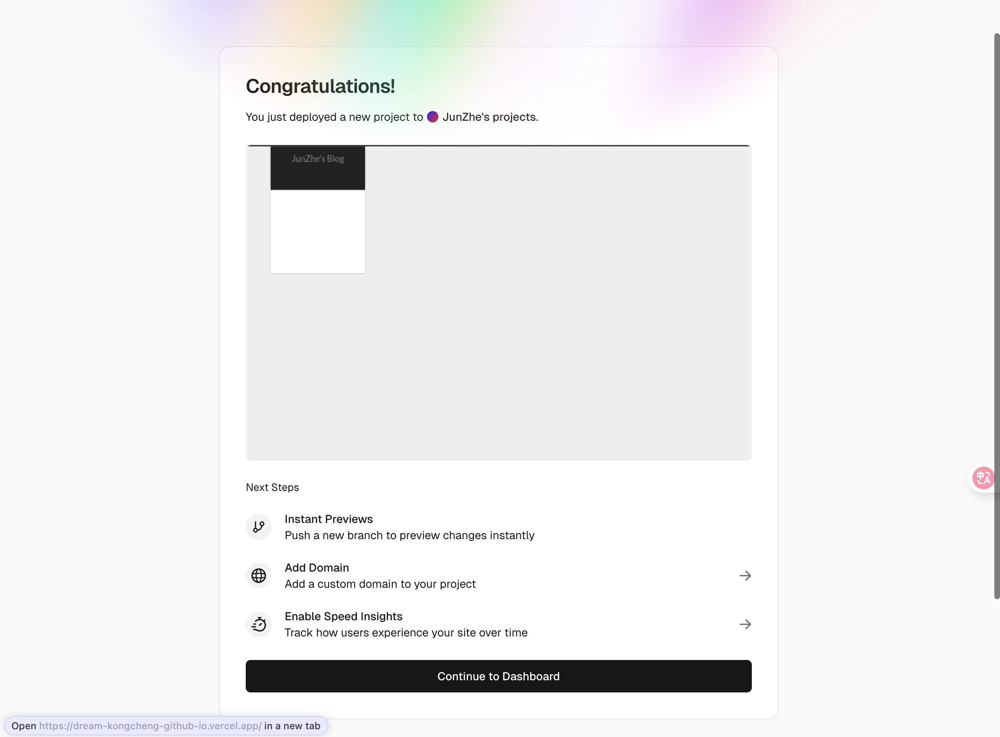
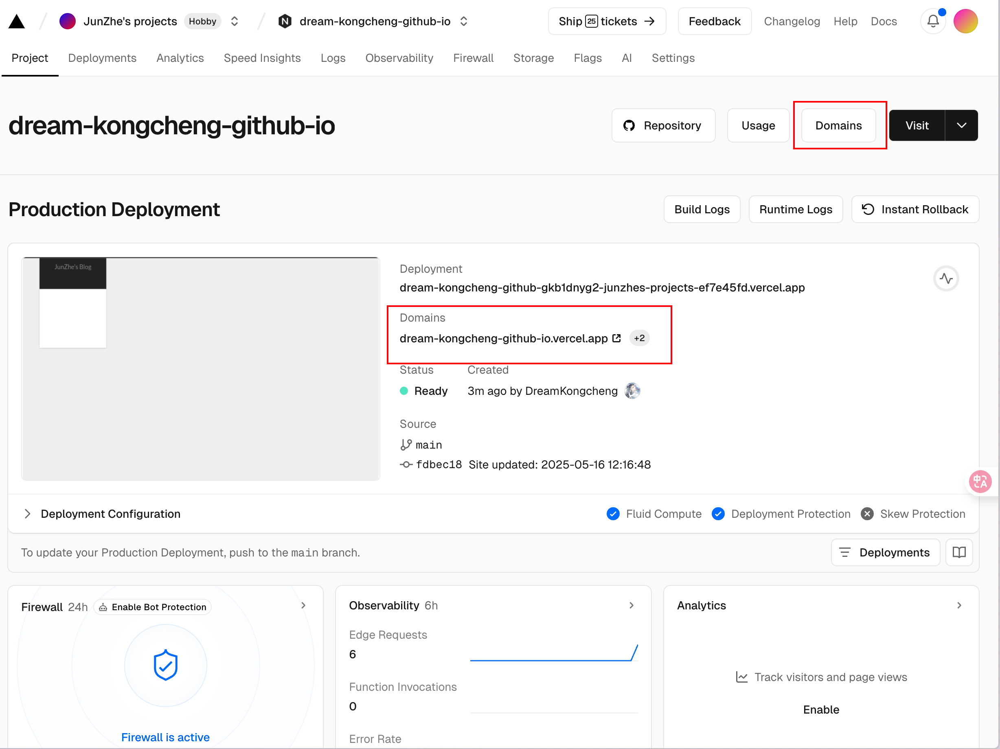
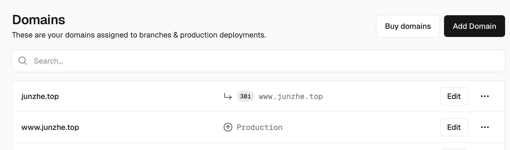
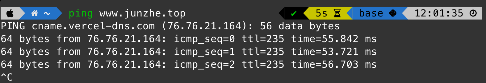

## 为什么要绑定域名

在使用 Hexo 搭建个人博客时，默认的域名是 GitHub Pages 提供的二级域名（如 username.github.io）。为了提升网站的专业性和可识别性，我们通常会选择绑定一个自定义的顶级域名（如 example.com）。

并且对于程序员来讲，拥有一个属于自己的域名看起来超酷的！

## 域名设置

### 步骤 1：购买域名

在域名注册商（如 Namecheap、GoDaddy、阿里云）购买一个域名。我自己是用的是阿里云，可以选择一些比较便宜的域名。

[阿里云域名控制台](https://dc.console.aliyun.com/#/overview)

### 步骤 2：实名认证

在购买域名后，需进行实名认证。根据国家政策，所有域名注册都需要实名制认证。通常需要提供身份证明文件和相关信息。

很多朋友在第一次接触于域名的时候不知道到底要做操作，比如我自己开始就不清楚以下问题：

1. 域名和服务器的关系，买域名是就买这个名字还是说要也要购买服务器？
2. 域名实名制之后还需要备案吗？

回答：

1. 如果你只是搭建 Hexo 博客（托管在 GitHub Pages 上），你只需要购买域名，不需要购买服务器，因为 GitHub Pages 已经提供了免费的托管服务（服务器）。
2. 如果你使用的是 GitHub Pages，通常不需要备案，因为 GitHub Pages 是一个国外的服务。但是如果你使用的是国内的服务器（如阿里云、腾讯云等），则需要进行备案。

根据中国法律，任何解析到中国大陆服务器的域名都必须完成 ICP 备案，否则会被拦截。

备案流程包括：

1. 提交资料（个人需身份证，企业需营业执照）。
2. 服务器提供商（如阿里云）初审。
3. 管局审核（通常 10-20 个工作日）。

而且备案需要购买服务器，这是一笔不小的开销。所以如果只是使用 Hexo+GitHub Pages 搭建个人博客的话完全不需要额外折腾，**买域名+实名制就可以了**！

实名认证一般需要 1 天的时间

### 步骤 3：设置 DNS 解析

需要将域名指向 GitHub Pages 的服务器。具体步骤如下：

1. 在控制台的域名列表中选择解析
   

1. 添加两条解析记录
   

```
记录类型: CNAME
主机记录: www
记录值: yourusername.github.io
TTL: 10分钟
```

```
记录类型: A
主机记录: @
记录值: 185.199.108.153（GitHub Pages IP）
```

其中 github pages 的 IP 地址可以在通过命令`ping yourusername.github.io`来获取

保存后等一会应该就行了

### 步骤 4：在 GitHub 上设置域名

1. 在 Hexo 博客的 source 文件夹下创建 CNAME 文件（无后缀），内容填写你的域名（如 example.com 或 www.example.com）
2. 重新部署博客

```bash
hexo clean && hexo generate && hexo deploy
```

理论上完成这两部就不需要再 GitHub 上进行任何操作了，因为 settings->pages 里面的 custom domain 其实也就是在设置 CNAME 文件而已

### 步骤 5：检查是否生效

```bash
ping example.com  # 检查是否指向 GitHub IP
nslookup example.com  # 查看 DNS 记录
```





如果出现了这样的结果，那么恭喜你，域名绑定成功了！现在你可以通过自己的域名访问 hexo 博客了。

## 访问加速

可以看到上面的图片中延迟有 100ms，实际体验下来访问速度也不是很快。
接下来，我们使用 Vercel 来加速访问速度。
[Vercel](https://vercel.com) 是一个免费的静态网站托管平台，支持自定义域名，并且提供全球 CDN 加速。

Vercel 类似于 github page，但远比 github page 强大，速度也快得多得多，而且将 Github 授权给 vercel 后，可以达到最优雅的发布体验，只需将代码轻轻一推，项目就自动更新部署了。（虽然我还是喜欢在本地用 hexo g && hexo d 来发布，感兴趣的朋友可以去折腾一下自动部署）

### 步骤 1：注册 Vercel 账号

GitHub 账号注册 Vercel 账号

### 步骤 2：创建一个新的项目

反正就选免费的就行了，然后第一次使用可能要先在 GitHub 上安装一下 Vercel 这个应用

直接选择导入

配置可以直接按照我图片里面的，默认就行了，然后点击 deploy


然后不出意外就导入成功了

### 步骤 3：修改域名


部署成功后，Vercel 会自动分配一个临时域名（如 your-hexo-repo.vercel.app），此时可通过该域名访问博客。

接下来我们绑定自己的域名，点击右上角 domains 进入设置，选择新建 Add Domain，然后输入自己的域名


在这里我添加了两条

### 步骤 4：修改 DNS 解析

现在由于用的还是前面的 DNS 解析项目，Vercel 这边会报错。接下来重新回到域名解析的地方（比如我是阿里云），按照 Vercel 中 Domains 提示的添加两条解析记录，并可以删除在第一部分**域名设置**中添加的解析记录

```
记录类型: CNAME
主机记录: www
记录值: your-hexo-repo.vercel.app
TTL: 10分钟
```

```
记录类型: A
主机记录: @
记录值: 76.76.21.21 # Vercel IP
TTL: 10分钟
```


现在的延迟只有 50ms 了！

以后 hexo d 的时候仓库的内容就会自动部署到 vercel 上了，然后访问速度也会提高很多

## 参考资料

[工具：使用 vercel 加速 Hexo 静态博客访问](https://vincentqin.tech/posts/speedup-gitpage/)
[vercel 是什么神仙网站？](https://zhuanlan.zhihu.com/p/347990778)
[Hexo + Git 搭建免费的个人博客](https://www.cylong.com/blog/2016/04/19/hexo-git/)